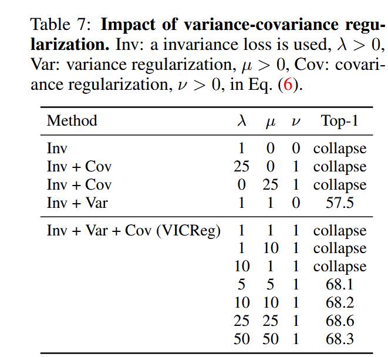

---

### **最终研究方案 : 基于VICReg原则的自适应视觉层融合**

#### **一、 核心思路与动机 (Core Idea & Motivation)**

本研究的起点，是继承并超越近期SOTA工作 **[Lin et al., 2025]** 的静态融合范式。旨在解决其“静态”策略无法“因图制宜”的根本局限性，提出一个**智能的、自适应的视觉前端**。与依赖“黑盒”可学习门控网络的主流做法不同，提出了一种**全新的、基于第一性原理的无监督评估框架**，该框架的核心是**直接在ViT每一层输出的“原生特征空间”中，客观地、保真地“测量”其表示质量**。

#### **二、 方法论：一个经过鲁棒性增强的三阶段流程**

现在明确地定义为一个三阶段流程，每个阶段都整合了针对潜在弱点的改进。

**1. 信号生成：经过标准化与平滑的质量信号测量**
   *   **Step 1.1: 任务自适应的视图生成**: 保持不变，通过数据增强生成双视图 (`view1`, `view2`)。
   *   **Step 1.2: 统一归一化与标准流程 (Default Normalization Pipeline)**:
      *   为了消除不同层级激活尺度的差异，将**强制**在计算任何指标之前，通过一个**固定的、不可训练的归一化管线**。
      *   **默认流程**: `LayerNorm -> (可选) 随机正交投影到固定低维 (如128维)`。此流程作为**默认设置**，确保所有后续测量的尺度统一和数值稳定。
   *   **Step 1.3: 层级化VICReg质量指标计算**: 在经过标准化的特征上，计算三个核心指标：**不变性($S_l$)**、**方差($V_l$)**、**高效近似的协方差($R_l$)**。
   *   **Step 1.4: 统计稳健性与多批次平滑 (Statistical Robustness with Cross-Batch Smoothing)**:
      *   为了解决单批次快照的噪声敏感性问题，引入**指数移动平均 (Exponential Moving Average, EMA)**。
      *   在训练/评估过程中，会维护三条EMA曲线 `EMA(S)`, `EMA(V)`, `EMA(R)`。每一批次计算出的新值都会用来平滑地更新这三条曲线。后续的决策将基于这些**更稳定、更具代表性**的平滑后曲线。

**2. 决策制定：带约束的、有原则的全局择优**
   *   **Step 2.1: 经过校准的结构化池划分**: 保持不变，采用经[Lin et al.]实验校准的功能性池划分（如`{1-8}`, `{9-18}`, `{19-24}`）。
   *   **Step 2.2: 全局最优代表选择算法**:
      *   在每个功能池内部，为**每一个**候选层`l`，计算一个**综合价值分数**:
         `Score(l) = w_S * Z(S_l) + w_V * Z(V_l) + w_R * Z(R_l)`
         *   其中 `Z(·)` 代表**Z-score标准化**。在计算分数前，先对每个指标（`S`, `V`, `R`）在池内的分布进行Z-score标准化，使其均值为0，标准差为1。这解决了不同指标尺度不一的问题。
         **权重`w`的有原则设定 (Principled Weight Setting)**:
         *   提出并实验策略：
            
                {25，25，1}
         **最终选择**: **综合价值分数最高**的层级，被选为该功能池的最终代表。

**3. 最终融合**
   *   将三个动态选择出的代表层特征，通过**外部直接相加**的方式融合，并送入LLM。

#### **三、 实验设计与行动计划**

**1. 验证指标与任务表现的相关性 (Pre-experiment: Justifying the Metrics)**
   *   **计划**: 在正式开始主实验前，将进行一个关键的**预备实验**。
   *   **做法**: 在ImageNet数据集上，将计算ViT每一层的 `S_l, V_l, R_l` 分数。同时，将在每一层上训练一个**线性分类器 (Linear Probe)**。
   *   **目标**: 计算并报告**`S, V, R`三条曲线与“线性探针分类准确率”曲线之间的皮尔逊相关系数**。一个强的、显著的相关性将为“指标→任务有效性”的核心假设提供**直接的、定量的因果证据**。

**2. 核心实验：Baseline对比**
   *   的最终模型与一个经过强化的、更全面的基线集合进行对比：
      1.  `Single-Layer` (基础基线)
      2.  `Static-Triple` (SOTA静态基线)
      3.  `Static-All` (性能上限基线)
      4.  **`Unconstrained-Gating` (SOTA动态基线)**: 实现一个**轻量级但强大的可学习门控基线**（例如，单层MLP + Sparse Top-k Gating），以证明“无训练前端”在性能和效率上的综合优势不是因为基线弱。
   *   **评估维度**: 保持不变（通用、OCR、CV-Centric、幻觉、Win Rate）。

**3. 关键消融实验 (Key Ablation Studies)**
   *   **协方差近似**: 实现并比较**三种**可扩展的`R_l`近似计算方法（如**随机投影、Nyström核近似、分块近似**），并报告它们的**时间/内存/近似误差**的权衡，最终选择一个最佳方案作为默认实现。
   *   **统计稳健性**: 对比“无平滑”、“移动平均平滑”和“EMA平滑”对最终层选择稳定性和任务性能的影响。
   *   **权重`w`的设定**: 对比“等权”、“交叉验证”和“贝叶斯优化”三种权重设定方法的效果。

**4. 寻找论文 (Literature Search - Refined)**
   *   在原有基础上，将额外聚焦以下两个方面：
      *   **高效近似计算**: 关键词 `Randomized Numerical Linear Algebra`, `Kernel Approximation`, `Nyström method`, `Random Fourier Features`，为协方差近似提供支持。
      *   **贝叶斯优化与超参数学习**: 关键词 `Bayesian Optimization for Hyperparameters`, `Learning to Learn (L2L)`, `Meta-Learning`，为`w`的自适应学习提供理论依据。

Weaknesses

* **指标→任务的有效性未验证**：文中多处断言 $S,V,R$ 能指示“有用层”，但没有呈现证明二者与下游性能（如 VQA、检索等）之间的统计关联或因果证据（No direct evidence found in the manuscript）。——找论文，实验
* **协方差计算的可扩展性问题**：直接计算每层 $D\times D$ 协方差在 D≈768、L=24 时代价高且内存大，文中虽提到“高效近似”，但缺少算法细节与复杂度分析（见“二—决策制定”中 R\_l 的描述）。——协方差有无高效近似算法
）。

Suggestions for Improvement (strict, actionable)

1. **验证指标与任务表现的相关性**：在小规模实验（如 ImageNet 下游 linear-probe / few-shot / layer-wise classifier）中量化每层 $S,V,R$ 与该层线性探针性能或微调性能的相关系数；若相关性弱，重新设计指标或引入额外度量（e.g., mutual information、CKA 与任务标签的相关性）。（直接针对“指标→任务有效性”）
2. **给出协方差近似实现与复杂度评估**：实现并比较三种可扩展近似（随机投影 + 协方差、Nyström/核近似的 CKA、分块/低秩近似），报告时间/内存/近似误差三者折中，选择可在大模型上可行的方案并作为默认实现。
3. **统一归一化与标准流程**：在信号生成阶段强制使用不可训练的归一化管线（LayerNorm +可选随机投影到固定低维），并在论文中把这一流程作为默认设置而非可选消融，减小层间尺度差异影响。
4. **对比学习式轻量前端**：务必在实验中加入轻量可学习 gating 基线（例如单层 MLP over pooled tokens + sparse top-k）来证明“无训练前端”的优势不是因为基线弱。

